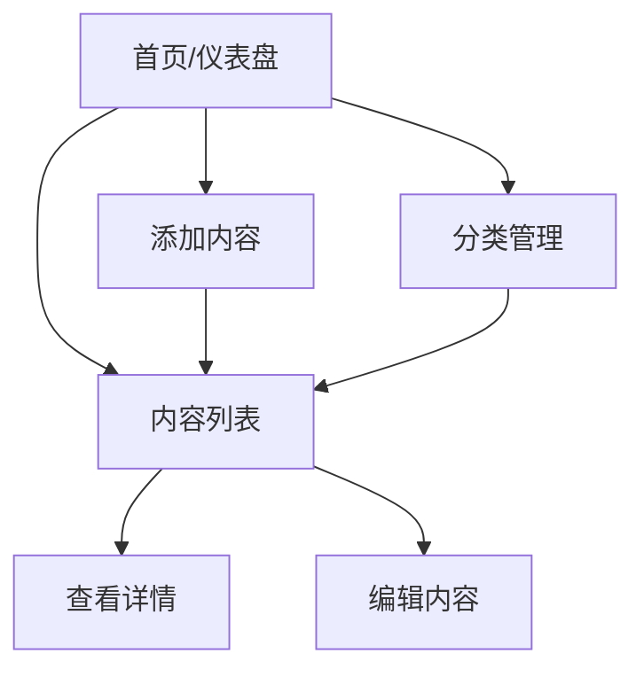

# 英语学习之旅 - 产品需求文档 (PRD)

## 1. 产品概述

一款专注于英语学习的个人内容管理应用，帮助用户组织、分类和追踪他们的英语学习内容。

- **核心目的**：让用户能够轻松管理各类英语学习材料（词汇、短语、文章），并通过分类和标签系统实现高效的复习计划
- **目标用户**：英语学习者，尤其是自主学习者
- **产品价值**：提供清晰的内容组织结构，支持快速添加和检索学习内容

## 2. 核心功能

### 2.1 功能模块

1. **内容管理首页**：展示所有学习内容概览，快速统计和入口
2. **内容添加/编辑**：添加新的单词、短语或文章内容
3. **分类管理**：创建和管理内容分类（如：日常词汇、商务英语、考试词汇等）
4. **标签系统**：为内容添加标签便于检索
5. **内容详情页**：查看内容的详细信息和上下文

### 2.2 页面详情

| 页面名称 | 模块名称 | 功能描述 |
|---------|---------|---------|
| 首页/仪表盘 | 概览统计 | 展示总词汇量、今日新增、待复习数量等关键指标 |
| 首页/仪表盘 | 最近添加 | 显示最近添加的学习内容列表 |
| 内容列表 | 筛选区域 | 支持按分类、标签搜索和筛选 |
| 内容列表 | 内容卡片 | 展示每条学习内容的核心信息（单词、音标、简要释义） |
| 添加内容 | 表单区域 | 输入单词/短语、释义、例句、分类、标签 |
| 分类管理 | 分类列表 | 查看、编辑、删除分类 |
| 分类管理 | 添加分类 | 创建新的分类 |

## 3. 核心流程

### 3.1 添加内容流程
用户点击"添加内容" → 填写表单（单词、释义、例句、选择分类） → 保存成功 → 返回列表

### 3.2 流程图


## 4. 用户界面设计

### 4.1 设计风格
- **整体调性**：温暖、专注、学术感 - 像一本精心设计的个人笔记本
- **主色调**：
  - 主色：#2D3436（墨灰色 - 用于主要文字）
  - 强调色：#6C5CE7（靛蓝色 - 用于按钮和交互元素）
  - 背景色：#FDFBF7（暖白色 - 纸张质感）
  - 次级背景：#F5F3EE（米白色 - 卡片背景）
  - 成功色：#00B894（薄荷绿）
  - 警告色：#FDCB6E（暖黄色）

- **字体**：
  - 标题：Playfair Display（衬线体 - 优雅学术感）
  - 正文：Noto Sans SC（无衬线 - 清晰易读）

- **按钮风格**：圆角矩形，柔和阴影，hover时有微妙的颜色过渡

- **布局风格**：
  - 卡片式布局为主
  - 左侧固定导航栏
  - 主内容区采用网格布局
  - 大量留白，呼吸感强

- **图标风格**：线性图标，圆润友好

### 4.2 页面设计概览

| 页面 | 模块 | 视觉描述 |
|------|------|---------|
| 首页 | 概览统计卡片 | 大号数字 + 描述文字，圆角卡片，hover微抬起 |
| 首页 | 最近添加列表 | 紧凑的列表样式，每项左侧有状态指示器 |
| 内容列表 | 搜索筛选栏 | 输入框 + 下拉选择器，扁平化设计 |
| 内容列表 | 内容卡片 | 单词居中，释义下方，右侧编辑/删除按钮 |
| 添加内容 | 表单 | 标签浮动动画，输入框带底部边框，提交按钮突出 |
| 分类管理 | 分类标签 | 彩色胶囊样式，hover显示操作按钮 |

### 4.3 响应式策略
- 桌面优先设计
- 平板适配：侧边栏收缩为图标
- 移动端适配：侧边栏隐藏为汉堡菜单

## 5. 数据结构

### 5.1 学习内容项
```
{
  id: string,
  word: string,           // 单词或短语
  pronunciation: string,   // 音标（可选）
  meaning: string,        // 释义
  example: string,        // 例句（可选）
  categoryId: string,     // 分类ID
  tags: string[],         // 标签数组
  createdAt: timestamp,
  updatedAt: timestamp,
  masteryLevel: number    // 掌握程度 0-5
}
```

### 5.2 分类
```
{
  id: string,
  name: string,           // 分类名称
  color: string,          // 颜色标识
  createdAt: timestamp
}
```

### 5.3 标签
```
{
  id: string,
  name: string,           // 标签名称
  color: string           // 颜色
}
```
