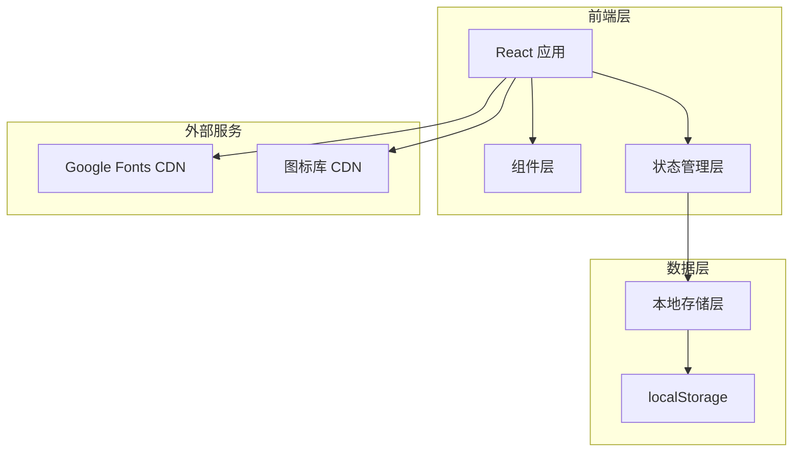
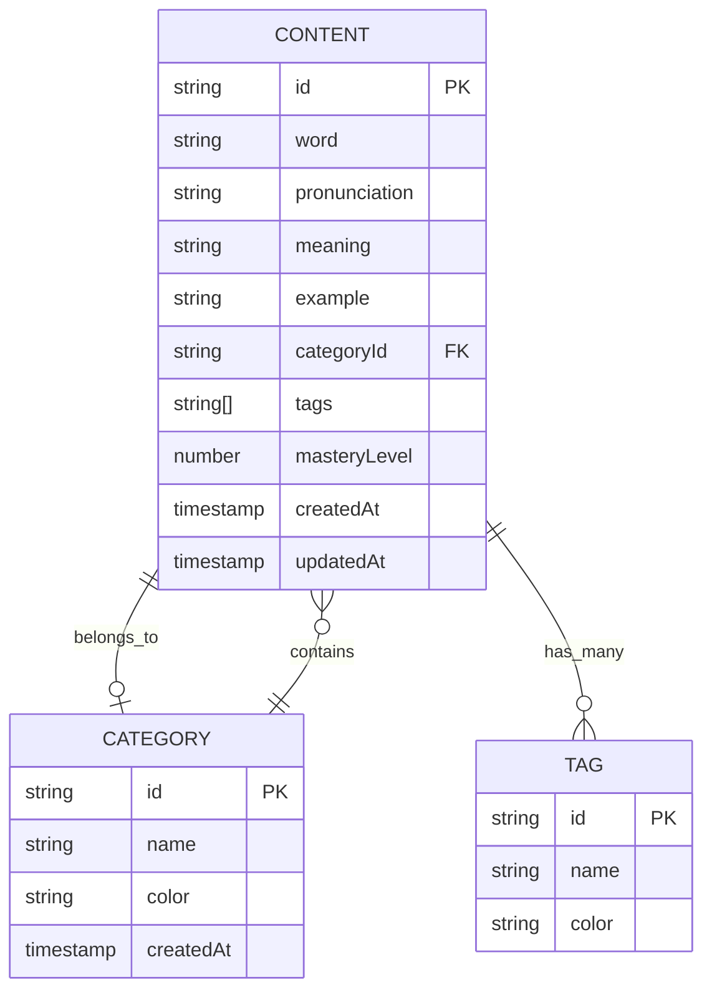

# 英语学习之旅 - 技术架构文档

## 1. 架构设计



## 2. 技术栈描述

- **前端框架**：React@18 + Vite
- **样式方案**：Tailwind CSS + 自定义 CSS 变量
- **图标库**：Lucide React（线性图标）
- **状态管理**：React useState/useContext（轻量级）
- **数据持久化**：localStorage（本地存储）
- **字体**：Google Fonts（Playfair Display + Noto Sans SC）

## 3. 路由定义

| 路由 | 页面名称 | 功能描述 |
|------|---------|---------|
| / | 首页/仪表盘 | 展示统计数据、最近添加内容 |
| /content | 内容列表 | 展示所有学习内容，支持筛选 |
| /content/add | 添加内容 | 新增学习内容表单 |
| /content/:id | 内容详情 | 查看单条内容详情 |
| /content/:id/edit | 编辑内容 | 编辑现有内容 |
| /categories | 分类管理 | 管理所有分类 |
| /tags | 标签管理 | 管理所有标签 |

## 4. 组件结构

```
src/
├── components/
│   ├── layout/
│   │   ├── Sidebar.tsx       # 侧边导航栏
│   │   ├── Header.tsx        # 顶部标题栏
│   │   └── Layout.tsx        # 整体布局容器
│   ├── content/
│   │   ├── ContentCard.tsx   # 内容卡片组件
│   │   ├── ContentList.tsx   # 内容列表组件
│   │   ├── ContentForm.tsx   # 内容表单组件
│   │   └── ContentStats.tsx  # 统计卡片组件
│   ├── category/
│   │   ├── CategoryTag.tsx   # 分类标签组件
│   │   ├── CategoryList.tsx  # 分类列表组件
│   │   └── CategoryForm.tsx # 分类表单组件
│   └── common/
│       ├── Button.tsx         # 按钮组件
│       ├── Input.tsx         # 输入框组件
│       ├── Modal.tsx         # 弹窗组件
│       └── EmptyState.tsx    # 空状态组件
├── pages/
│   ├── Dashboard.tsx         # 首页
│   ├── ContentList.tsx       # 内容列表页
│   ├── ContentDetail.tsx     # 内容详情页
│   ├── ContentFormPage.tsx   # 添加/编辑内容页
│   ├── CategoriesPage.tsx    # 分类管理页
│   └── TagsPage.tsx          # 标签管理页
├── contexts/
│   ├── ContentContext.tsx    # 内容数据上下文
│   └── AppContext.tsx        # 全局应用上下文
├── hooks/
│   ├── useLocalStorage.ts    # localStorage Hook
│   └── useContent.ts         # 内容操作 Hook
├── utils/
│   ├── storage.ts            # 存储工具函数
│   └── helpers.ts            # 辅助函数
└── types/
    └── index.ts              # TypeScript 类型定义
```

## 5. 数据模型

### 5.1 数据模型定义



### 5.2 TypeScript 类型定义

```typescript
interface Content {
  id: string;
  word: string;
  pronunciation?: string;
  meaning: string;
  example?: string;
  categoryId: string;
  tags: string[];
  masteryLevel: number;
  createdAt: number;
  updatedAt: number;
}

interface Category {
  id: string;
  name: string;
  color: string;
  createdAt: number;
}

interface Tag {
  id: string;
  name: string;
  color: string;
}
```

## 6. 核心功能实现

### 6.1 内容管理 CRUD

- **创建 (Create)**：表单提交 → 验证 → 生成ID → 存入localStorage
- **读取 (Read)**：从localStorage获取 → 状态提升 → 组件渲染
- **更新 (Update)**：表单预填 → 修改 → 验证 → 更新localStorage
- **删除 (Delete)**：确认弹窗 → 从数组移除 → 更新localStorage

### 6.2 分类管理

- 预设分类：日常词汇、商务英语、考试词汇、习惯用语
- 支持自定义添加、编辑颜色
- 删除时检查是否有关联内容

### 6.3 搜索和筛选

- 实时搜索：基于word和meaning字段
- 分类筛选：单选/多选
- 标签筛选：多选

## 7. 初始数据

应用初始化时预设以下示例数据：

### 分类
1. 日常词汇 (#6C5CE7)
2. 商务英语 (#00B894)
3. 考试词汇 (#FDCB6E)
4. 习惯用语 (#E17055)

### 示例内容
- 10条不同分类的示例单词/短语
- 包含音标、释义和例句
